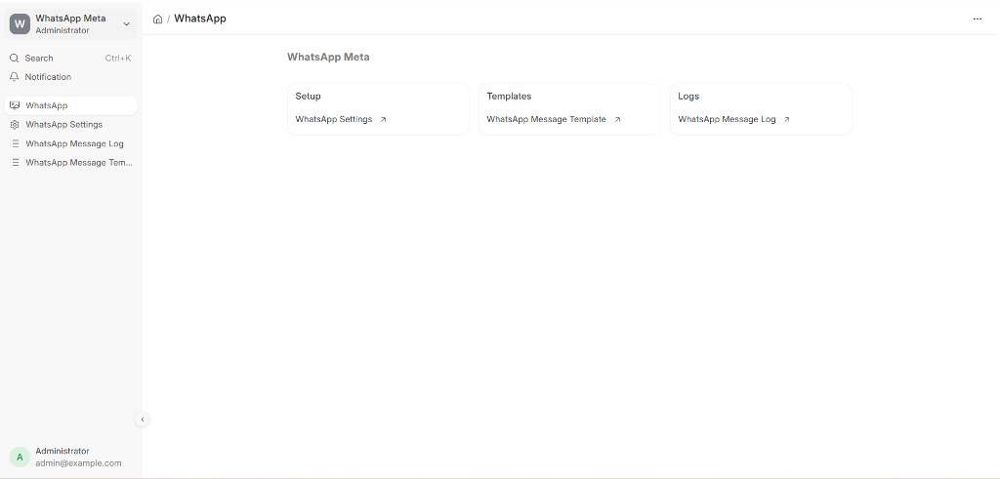
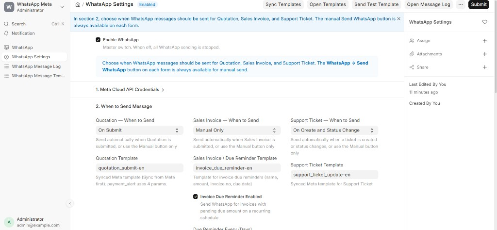
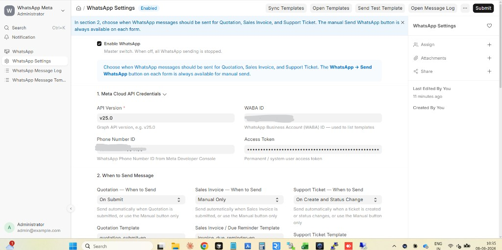
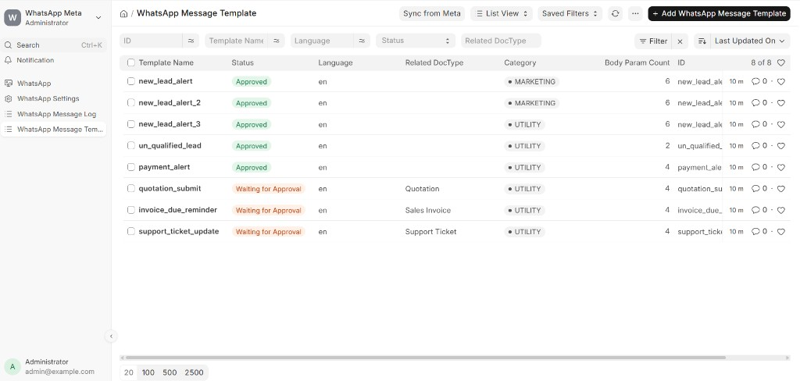
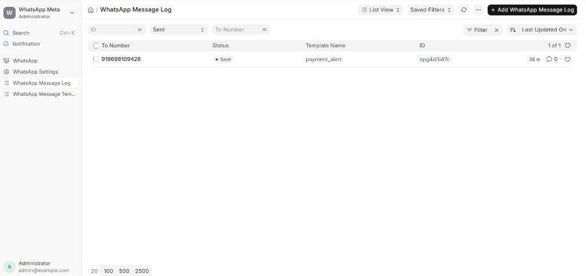

# THS WhatsApp / frappe-whatsapp

<p align="center">
  
</p>

WhatsApp Meta Cloud API integration for ERPNext / Frappe.

**Copyright (c) 2026 THS Solution**

Repository: https://github.com/sathish136/frappe-whatsapp

## Screenshots

### Workspace


### WhatsApp Settings




### Message Templates


### Message Log


## Features

- WhatsApp Settings (Meta credentials, when-to-send rules)
- WhatsApp Message Template DocType (sync from Meta, create + submit for approval, preview)
- Send templates from **Quotation**, **Sales Invoice**, and **Support Ticket**
- Auto-send on Quotation submit / Support Ticket create & status change
- Invoice due reminder every N days (scheduler)
- WhatsApp Message Log for outbound messages

## Compatibility

Declared in `pyproject.toml` for Frappe Cloud / Marketplace:

```toml
[tool.bench.frappe-dependencies]
frappe = ">=14.0.0,<17.0.0"
```

Supports **Frappe v14**, **v15**, and **v16**.

## Install

```bash
cd /path/to/frappe-bench
bench get-app https://github.com/sathish136/frappe-whatsapp.git --branch main
bench --site your.site install-app ths_whatsapp
```

> App Python package name is `ths_whatsapp`.

## Setup

1. Open **WhatsApp Settings**
2. Enter Phone Number ID, Access Token, WABA ID
3. Enable WhatsApp
4. **Sync Templates** (or create templates and Submit for Approval)
5. Link templates to Quotation / Sales Invoice / Support Ticket and set when to send

## License

MIT — Copyright (c) 2026 THS Solution
